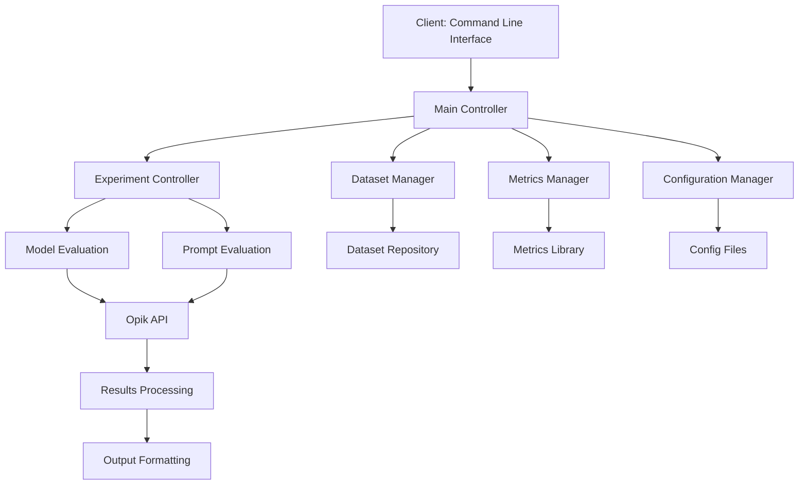
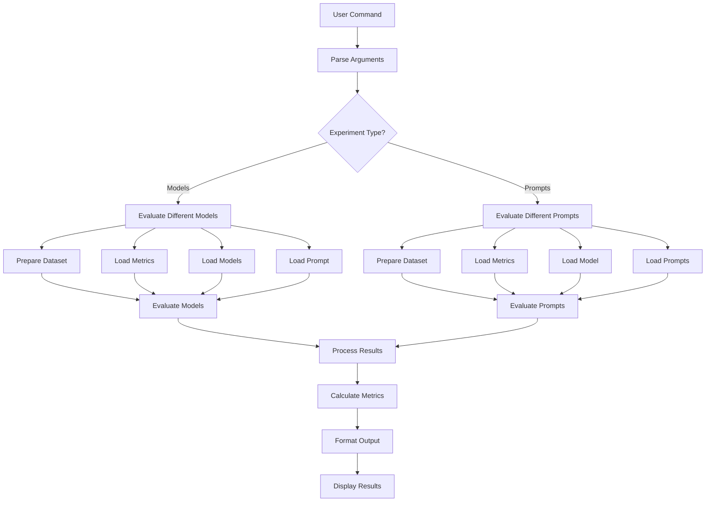
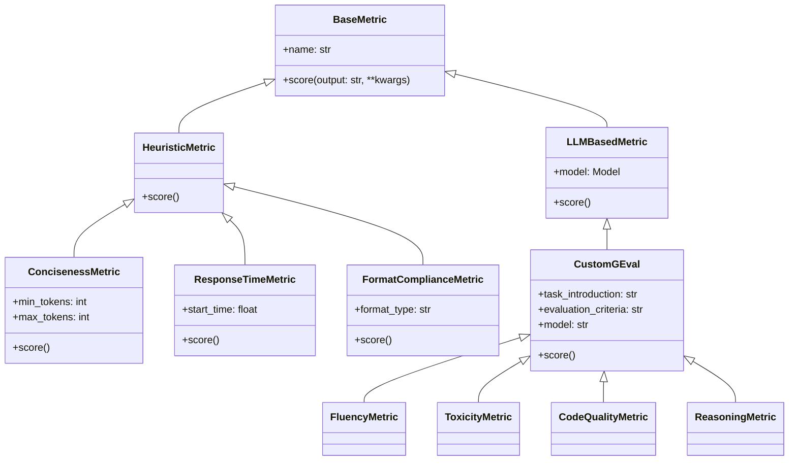
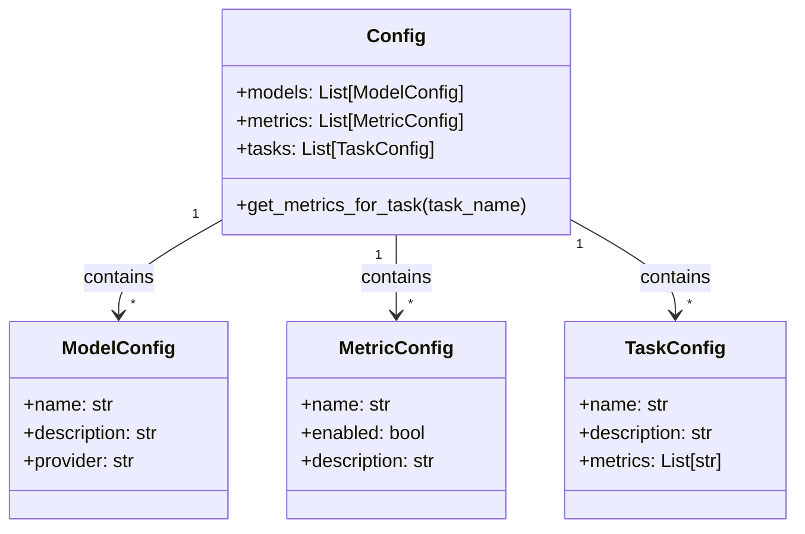
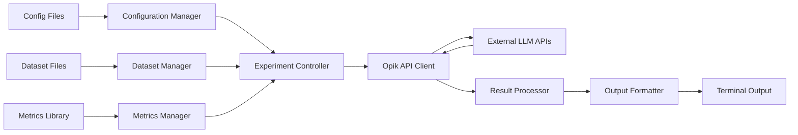
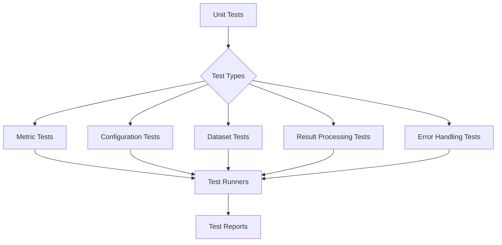
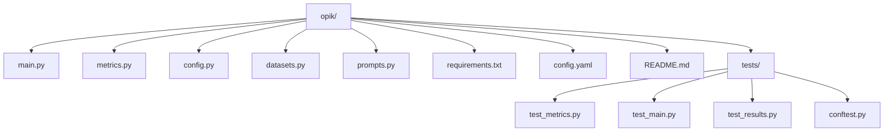

# Opik Evaluation Suite Architecture

This document outlines the architecture of the Opik Evaluation Suite, which provides a comprehensive framework for evaluating Large Language Models across multiple tasks and metrics.

## High-Level Architecture

## Component Architecture

### Evaluation Pipeline

### Metrics System

### Configuration System

### Data Flow Architecture

### Test Framework Architecture

## Directory Structure

